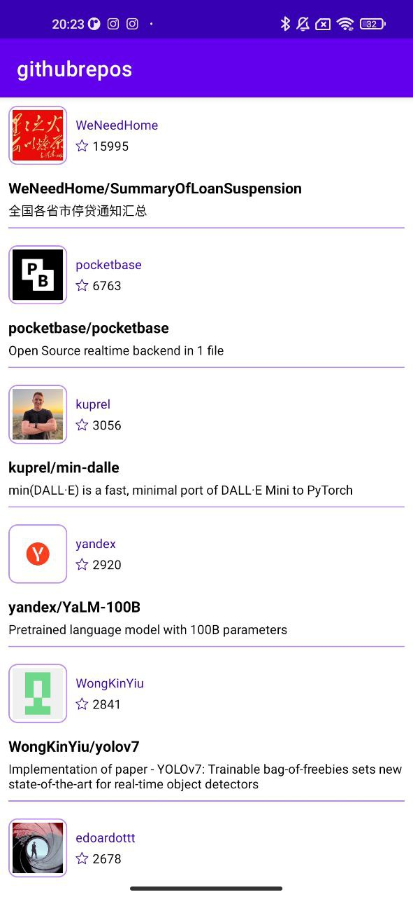

# Trending Github repos
App(sample project) that displays Github most starred repos, the app will fetch JSON data directly from the Github API for the last 30 days.

# App's Functionality
1. Shows the most trending repositories for the last 30 days.
2. Add a loading status footer to your list.
3. Show loading progress between every new repository paging.
4. Saves states when rotating.

# Screenshots

# Used libraries
`Retrofit` - standard library, which allows communication with HTTP client api. It using for fetching data from Github.

`Paging` - Google's Jetpack library, which implementing pagination. Load data from network requests on each page by tracking user's scroll event. 

`Coroutines` - Kotlin approach to make code asynchronous. 

`Koin` - DI library, fully Kotlin friendly, one of the way to implement dependency injection(IoC). We can use `Hilt`, `Dagger` or any other, but Koin is simple in use.

Since we presenting avatar image from url path, `Coil` easy to use and backed with Kotlin Coroutines. 

# Architecture approaches
`MVVM` - pattern for presentation layer. 
`Clean Architecture` to separate business logic, helpful to scale project and easy to test later.